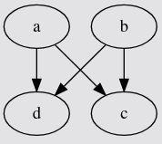
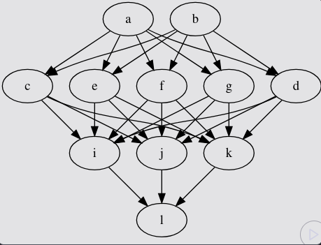

# Dataset Augmentation with Generative Adversarial Networks

## Introduction

Generative Adversarial Networks (GANs) have emerged as a powerful framework for generating synthetic data that closely resembles real data distributions. Originally proposed by Ian Goodfellow et al. in 2014, GANs operate through an adversarial process involving two neural networks: a **Generator** that creates synthetic data and a **Discriminator** that attempts to distinguish between real and generated samples.

This project demonstrates the application of GANs for dataset augmentation using PyTorch. Dataset augmentation is crucial in machine learning, particularly when working with limited training data. By generating synthetic samples that follow the same distribution as the original data, we can effectively expand our dataset, potentially improving model generalization and performance.

### Objectives

- Implement a Generative Adversarial Network from scratch using PyTorch
- Generate synthetic data that follows a linear relationship pattern
- Visualize the training process and quality of generated samples
- Demonstrate how GANs can be used for data augmentation tasks
- Analyze the convergence of generator and discriminator losses during training

### Project Organization

```
.
├── GAN_Pytorch.ipynb                  : Complete GAN implementation and training
├── images/                             : Contains architecture diagrams
│   ├── generator.png                  : Generator neural network architecture
│   └── discriminator.png              : Discriminator neural network architecture
├── README.md                          : Project documentation
└── LICENSE                            : Project license

```

## Description

### What are GANs?

Generative Adversarial Networks consist of two competing neural networks:

1. **Generator (G)**: Takes random noise as input and generates synthetic data samples. Its goal is to produce data so realistic that the discriminator cannot distinguish it from real data.

2. **Discriminator (D)**: Takes both real and generated samples as input and attempts to classify them correctly. It outputs the probability that a given sample is real rather than fake.

These two networks are trained simultaneously in an adversarial manner:
- The generator tries to **maximize** the probability of the discriminator making a mistake
- The discriminator tries to **minimize** its classification error

This adversarial process can be formulated as a minimax game where both networks improve iteratively until an equilibrium is reached.

### Dataset

For this project, we create a synthetic dataset that approximates a linear relationship between two variables X and Y using the formula:

$$Y = XA + b$$

This is a vectorized representation of linear regression, where:
- **X** is generated from a normal distribution with mean 0 and standard deviation 1
- **A** is a transformation matrix: `[[1, 2], [-0.1, 0.5]]`
- **b** is a bias vector: `[1, 2]`

The dataset contains 1000 samples with 2 features each, creating a 2D point cloud that follows a specific linear pattern. This simple yet effective dataset allows us to visually verify the quality of generated samples.

### Neural Network Architectures

#### Generator

The generator uses a simple single-layer neural network:
- **Input**: 2-dimensional noise vector (latent space)
- **Output**: 2-dimensional data point
- **Architecture**: Linear layer (2 → 2)



Since our target dataset follows a linear relationship, a single-layer linear network is sufficient for the generator to learn the transformation.

#### Discriminator

The discriminator uses a more complex multi-layer architecture:
- **Input**: 2-dimensional data point (real or generated)
- **Hidden Layers**: 
  - Linear layer (2 → 5) with Tanh activation
  - Linear layer (5 → 3) with Tanh activation
- **Output**: Linear layer (3 → 1) producing a single scalar value
- **Loss Function**: Binary Cross-Entropy with Logits (BCEWithLogitsLoss)



The discriminator requires more capacity to learn the decision boundary between real and fake samples effectively.

## Methodology

### Training Process

The GAN training follows an alternating optimization strategy:

#### 1. **Discriminator Update**
   - Sample a batch of real data points from the dataset
   - Generate a batch of fake data points using the generator with random noise
   - Compute discriminator loss on real samples (target: 1 for real)
   - Compute discriminator loss on fake samples (target: 0 for fake)
   - Average the two losses and backpropagate to update discriminator weights
   - This trains the discriminator to better distinguish real from fake samples

#### 2. **Generator Update**
   - Generate a batch of fake data points using random noise
   - Pass generated samples through the discriminator
   - Compute loss treating generated samples as real (target: 1)
   - Backpropagate to update generator weights
   - This trains the generator to produce more realistic samples that fool the discriminator

### Key Implementation Details

**Hyperparameters:**
- Batch size: 8
- Learning rate (Discriminator): 0.05
- Learning rate (Generator): 0.005
- Latent dimension: 2
- Number of epochs: 30
- Optimizer: Adam for both networks
- Loss function: Binary Cross-Entropy with Logits

**Weight Initialization:**
- All network weights initialized from normal distribution (mean=0, std=0.02)

**Training Features:**
- Real-time visualization of generated data distribution vs real data
- Loss tracking for both generator and discriminator
- Automatic plot updates after each epoch

### Visualization

The training process includes two real-time plots:

1. **Loss Plot**: Shows the discriminator loss (blue) and generator loss (green) over epochs, helping monitor training stability and convergence

2. **Distribution Plot**: Displays scatter plots comparing real data points (blue) with generated data points (orange), visually demonstrating the quality of generated samples

## Results and Conclusions

### Training Dynamics

During training, we observe the following dynamics:

1. **Early Stages**: The discriminator quickly learns to distinguish between real and fake samples, resulting in high generator loss
2. **Mid Training**: The generator improves and starts producing more realistic samples, making the discriminator's task harder
3. **Convergence**: Both networks reach an equilibrium where the generator produces high-quality samples and the discriminator approaches 50% accuracy (cannot reliably distinguish real from fake)

### Key Findings

✅ **Successful Data Generation**: The generator successfully learns the linear relationship in the data and produces synthetic samples that closely match the real data distribution

✅ **Visual Quality**: The scatter plots demonstrate that generated samples overlap well with the real data cloud, indicating effective learning

✅ **Balanced Training**: The loss curves show relatively stable training without mode collapse or discriminator dominance, indicating a well-balanced adversarial process

✅ **Computational Efficiency**: With only 30 epochs, the GAN achieves good results, processing approximately 1000+ examples per second

### Practical Applications

This implementation demonstrates that GANs can be effectively used for:

- **Data Augmentation**: Expanding limited datasets for machine learning tasks
- **Synthetic Data Generation**: Creating privacy-preserving synthetic datasets
- **Imbalanced Data Handling**: Generating additional samples for minority classes
- **Simulation**: Creating realistic data for testing and validation
- **Feature Learning**: Understanding underlying data distributions

### Limitations and Future Work

**Current Limitations:**
- Simple linear relationship - more complex patterns would require deeper architectures
- 2D data only - real-world applications often involve high-dimensional data
- No evaluation metrics beyond visual inspection

**Future Enhancements:**
- Implement quantitative evaluation metrics (Inception Score, FID)
- Extend to higher-dimensional data and images
- Apply conditional GANs (cGANs) for controlled generation
- Experiment with more advanced GAN variants (WGAN, StyleGAN)
- Test on real-world datasets with complex distributions
- Implement early stopping and checkpointing
- Add data augmentation techniques combined with GAN generation

### Conclusion

This project successfully demonstrates the implementation and application of Generative Adversarial Networks for dataset augmentation. The GAN framework proves to be a powerful tool for learning and replicating data distributions, even with simple architectures. The visualization capabilities provide clear insights into the training process and quality of generated samples.

GANs represent a significant advancement in generative modeling and have numerous applications beyond data augmentation, including image synthesis, style transfer, and domain adaptation. This foundational implementation serves as a starting point for exploring more complex GAN architectures and applications.

## Technologies Used

- **PyTorch**: Deep learning framework for implementing neural networks
- **Matplotlib**: Visualization library for plotting data distributions and losses
- **IPython**: Interactive computing for real-time visualization updates

## Getting Started

### Prerequisites

```bash
pip install torch matplotlib ipython
```

### Running the Project

1. Clone the repository
2. Open `GAN_Pytorch.ipynb` in Jupyter Notebook or JupyterLab
3. Run all cells sequentially to train the GAN
4. Observe the real-time visualizations of loss curves and generated data

### Customization

You can experiment with:
- Different data distributions by modifying the transformation matrix A and bias vector b
- Various network architectures for generator and discriminator
- Different hyperparameters (learning rates, batch size, latent dimension)
- Number of training epochs

## License

This project is available for educational and research purposes.

## References

- Goodfellow, I., et al. (2014). "Generative Adversarial Networks." arXiv:1406.2661
- PyTorch Documentation: https://pytorch.org/docs/
- GAN Tutorial: https://pytorch.org/tutorials/beginner/dcgan_faces_tutorial.html

## Acknowledgments

This implementation is inspired by the original GAN paper and various PyTorch tutorials on generative models.
